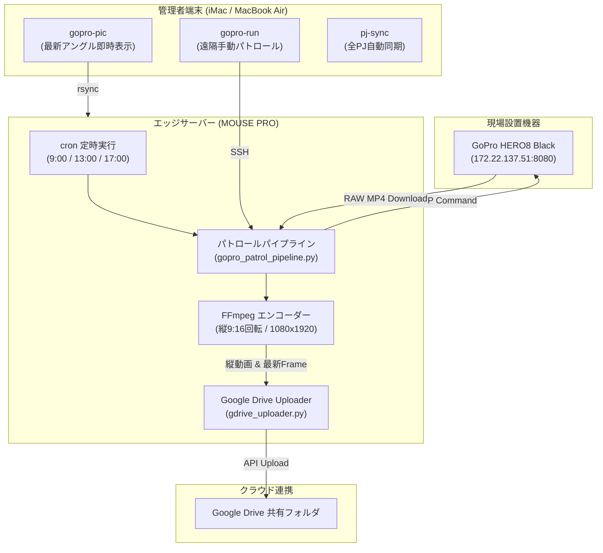

# 📷 GoPro Patrol System (gopro-patrol) - プロジェクト全体概要書

## 1. プロジェクト概要

**gopro-patrol** は、定位置に設置された **GoPro HERO8 Black** をエッジサーバー（**MOUSE PRO**）経由で遠隔制御し、定時パトロール撮影・映像の自動回収・SNS用縦動画（9:16）自動エンコード・Google ドライブ自動同期・Mac端末（iMac / MacBook Air）からのワンコマンド閲覧を一気通貫で完結させる**全自動遠隔監視・パトロールシステム**です。

---

## 2. システムアーキテクチャ & 処理フロー



---

## 3. 主要機能

### 1. 🤖 定時全自動パトロール (cron)
* 毎日 **9:00 / 13:00 / 17:00** に MOUSE PRO 上でパトロールスクリプトが自動起動。
* 人間の操作なしで自動撮影・回収・処理・保存を完遂します。

### 2. 🎬 15秒ショートクリップ撮影 ＆ 回収
* 遠隔指示により、GoPro HERO8 が 15 秒間の撮影を行い自律停止。
* MOUSE PRO が高速 HTTP 通信で最新の MP4 動画を自動回収します。

### 3. 📱 SNS用 縦動画 (9:16 / 1080×1920) 自動エンコード
* GoPro の横向き映像を、FFmpeg が自動で 90 度回転（`transpose=1`）。
* **Instagram リール / TikTok / YouTube Shorts / X** にそのまま直接投稿できる縦型 H.264 MP4 フォーマット（1080×1920）へ自動変換します。

### 4. ☁️ Google ドライブ共有フォルダ自動同期
* 変換された縦動画を、撮影日時付きファイル名（例: `20260727_110500_vertical.mp4`）で Google ドライブ共有フォルダへ自動アップロード。

### 5. 💻 ワンコマンド遠隔トリガー ＆ 即時ビューアー
* 手元の Mac（iMac / MacBook Air）のターミナルから 1 コマンドで全遠隔操作が可能。

### 6. 🔄 マルチ Mac 完全自動PJ同期 (pj-sync)
* 新規作成されたプロジェクトを自動検出して GitHub Private リポジトリを作成し、iMac ✕ MacBook Air 間で全自動同期。

---

## 4. クライアント操作コマンドマニュアル (Cheatsheet)

管理者端末（iMac または MacBook Air）のターミナルで利用可能な専用エイリアス一覧です。

| コマンド | 役割・説明 |
| :--- | :--- |
| **`gopro-run`** | 今すぐ定位置で 15秒縦動画パトロールを手動トリガーし、Googleドライブへ保存します。 |
| **`gopro-pic`** | 最新の定位置縦向きアングル写真（`gopro_cam.jpg`）を 1 秒で Mac 画面に表示します。 |
| **`pj-sync`** | 全プロジェクト（`~/git-projects` 内）の変更を GitHub へ一括同期し、Mac 間で最新化します。 |

---

## 5. システムネットワーク & 設定仕様情報

### ネットワーク構成

| 機器名 | 役割 | IP アドレス | ユーザー名 |
| :--- | :--- | :--- | :--- |
| **MOUSE PRO** | エッジ処理サーバー (Ubuntu) | `192.168.10.117` (ホスト名: `mouse`) | `sawadiiii` |
| **GoPro HERO8** | 撮影カメラ | `172.22.137.51:8080` | - |
| **SAWADI-iMac** | メイン開発・運用 Mac | `192.168.10.116` | `sawadiiii` |
| **MacBook Air** | サブ運用 Mac | `192.168.10.108` | `p` |

### ディレクトリ構成 (MOUSE PRO)

```text
/var/secured_vault/
├── camera/
│   ├── raw_gopro.mp4         # GoProから取得したRAW動画
│   ├── latest_vertical.mp4    # 9:16 縦向き変換済み動画
│   └── cam.jpg                # 最新1フレーム静止画
├── scripts/
│   ├── gopro_patrol_pipeline.py  # メインパトロールスクリプト
│   ├── gdrive_uploader.py        # Google Drive アップローダー
│   ├── pipeline_history.json     # アップロード二重防止履歴
│   └── client_secret.json        # Google Drive OAuth認証情報
└── venv/                      # Python 仮想環境
```

---

## 6. 保守・運用・セキュリティポリシー

- **外部破壊・デプロイ承認:** 外部環境や本番環境への変更は、必ず人間の確認・承認を経て実行すること。
- **個人情報保護:** クライアント個人情報・宿泊客予約情報の外部送信・公開を厳禁とする。
- **コード変更出力:** ソースコードの変更を行う際は、必ず差分（Code diffs）を Artifacts として出力すること。
